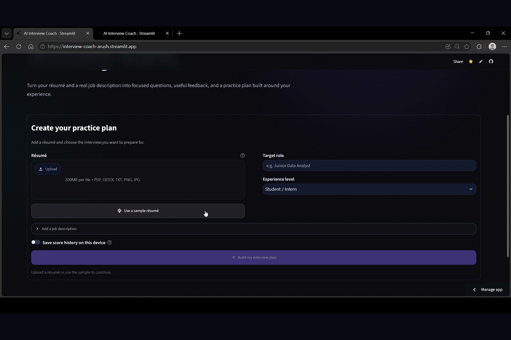
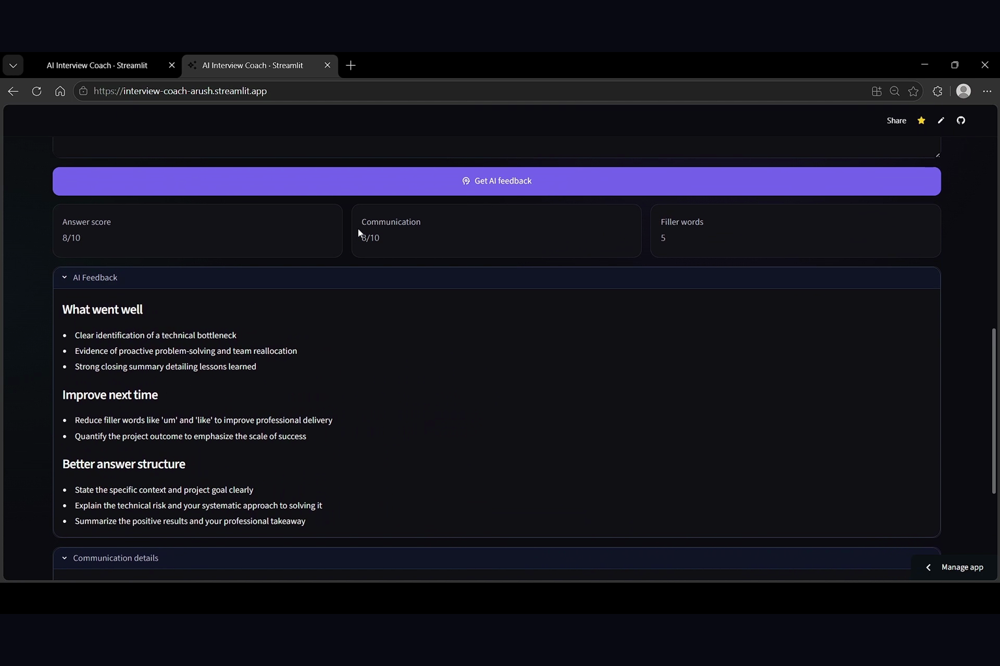
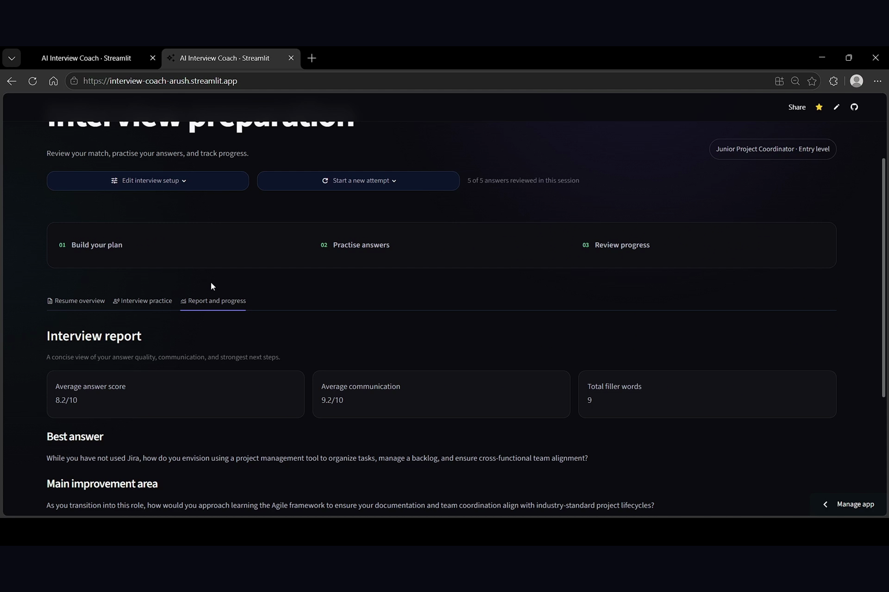
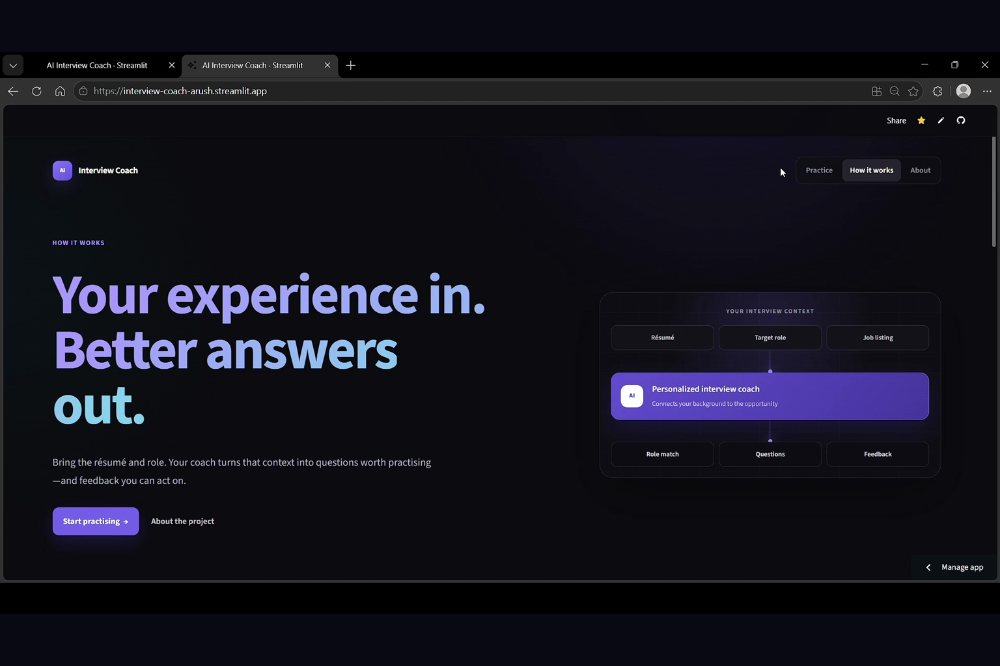
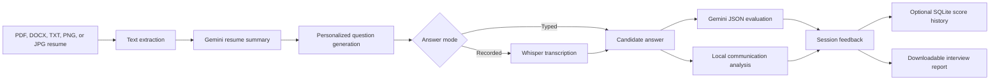

# AI Interview Coach

### Resume-aware, multimodal interview practice with Gemini and Whisper

[](https://www.python.org/)
[](https://ai.google.dev/)
[](https://github.com/openai/whisper)
[](https://streamlit.io/)
[](https://github.com/Arush-Reddy/Interview-Coach/actions/workflows/ci.yml)
[](LICENSE)

[**Try the live app**](https://interview-coach-arush.streamlit.app/) ·
[**Watch the demo**](https://www.youtube.com/watch?v=dmzWsRf0Tiw) ·
[Architecture](docs/architecture.md) ·
[Testing](docs/testing.md) ·
[Development log](docs/development-log.md)

AI Interview Coach turns a resume into a focused practice loop. It extracts a
PDF, DOCX, TXT, PNG, or JPG résumé, asks Gemini to build a target-role briefing,
generates five role-specific interview questions, evaluates typed or recorded
answers, and builds a progress report with communication metrics.

The project combines generative AI with deterministic analysis instead of
treating an LLM response as the entire product. Gemini handles resume-aware
reasoning and qualitative feedback; local Python code measures filler words,
speaking pace, session progress, and report statistics.

> **Status:** working portfolio prototype. It is designed for practice and
> self-reflection, not recruitment screening or automated hiring decisions.

## Product tour

| Create a role-specific plan | Review structured answer feedback |
| --- | --- |
|  |  |

| See the complete interview report | Understand the workflow |
| --- | --- |
|  |  |

## Why this project is interesting

- **Grounded generation:** questions and feedback are conditioned on the
  candidate's own resume and answer.
- **Multimodal practice:** candidates can type an answer or record speech and
  transcribe it locally with Whisper.
- **Structured feedback:** Gemini returns validated JSON rather than
  unstructured text that the UI cannot reliably interpret.
- **Deterministic communication signals:** filler counts, word count, and
  speaking rate remain transparent and testable.
- **Stateful product design:** Streamlit session state supports a
  one-question-at-a-time interview flow without losing progress on reruns.
- **Accessible presentation:** a persistent accessibility mode enlarges text
  and controls, strengthens contrast, reduces motion, and improves focus
  visibility.
- **Privacy-aware defaults:** uploaded documents are processed in memory, score
  persistence is opt-in, and displayed history is scoped to the current
  interview session.

## System architecture



See [the architecture document](docs/architecture.md) for component
responsibilities, data boundaries, and the full request lifecycle.

## Features

- PDF, DOCX, TXT, PNG, and JPG extraction with size and content validation.
- Gemini image transcription for clear resume screenshots and scans.
- Target-role resume briefing grounded in supplied resume content.
- Optional pasted or uploaded job description matching.
- Evidence-based comparison of requirements, transferable skills, and gaps.
- Five role- and experience-specific technical, behavioral, and growth questions.
- Typed and microphone-recorded answer modes.
- Local Whisper transcription with bundled ffmpeg discovery.
- Validated 1–10 answer score with strengths, improvements, and a better
  response structure.
- Filler-word, word-count, and words-per-minute analysis.
- One-question-at-a-time navigation and progress tracking.
- Downloadable Markdown interview report.
- Optional session-scoped SQLite score history.
- Persistent accessibility mode and keyboard-visible focus states.
- Responsive dark Streamlit interface with dedicated Practice, How it works,
  and About pages.
- Docker support and automated GitHub tests.

## Validation snapshot

| Capability | Validation |
| --- | --- |
| Automated suite | 16 tests pass locally on Python 3.12 |
| Resume extraction | TXT cleanup, DOCX paragraphs/tables, PNG/JPEG routing, and failure messages |
| Grounding | Tests verify job-description context reaches summary and question prompts |
| Question parsing | Exactly five numbered questions are required |
| Reports | Scores, communication metrics, and filler counts are aggregated |
| SQLite privacy | History reads are restricted to the current session identifier |
| Speech dependency | ffmpeg is exposed under the command name Whisper expects |
| Streamlit | Initial render and a complete mocked sample-profile interview are smoke-tested |

These checks validate application behavior, not interview-feedback accuracy.
Gemini availability and output can vary by account, model access, quota, and
time. See [Testing and evaluation](docs/testing.md) for the exact automated
coverage, manual checks, and remaining evaluation work.

## Documentation

| Document | Purpose |
| --- | --- |
| [Architecture](docs/architecture.md) | System flow, module ownership, and data lifecycle |
| [Testing and evaluation](docs/testing.md) | Reproducible test commands, coverage, and open risks |
| [Development log](docs/development-log.md) | Milestones, engineering decisions, and lessons learned |

## Quick start

Python 3.12 is recommended.

```powershell
git clone https://github.com/Arush-Reddy/Interview-Coach.git
cd Interview-Coach
py -3.12 -m venv .venv
.\.venv\Scripts\Activate.ps1
python -m pip install -r requirements.txt
Copy-Item .env.example .env
```

Add a Google AI Studio key to `.env`:

```dotenv
GEMINI_API_KEY=your_key_here
```

Run the app:

```powershell
streamlit run app.py
```

Then open `http://localhost:8501`.

## Project structure

```text
app.py                      Streamlit UI and interview state machine
pages/                      Product information pages
utils/gemini_client.py      Gemini model selection and API access
utils/pdf_reader.py         Document and resume-image text extraction
utils/summarizer.py         Grounded target-role briefing prompt
utils/question_generator.py Question generation and strict parsing
utils/evaluator.py          Structured answer evaluation
utils/speech.py             Whisper loading and ffmpeg configuration
utils/communication.py      Deterministic speaking-quality signals
utils/database.py           Parameterized, session-scoped SQLite storage
utils/report.py             Aggregate report generation
tests/                      Core logic and Streamlit smoke tests
docs/                       Architecture, testing, development, and product media
```

The modules are intentionally small and single-purpose so the AI calls,
deterministic analysis, persistence, and UI can be understood independently.

## Security and privacy

- `.env` and `.streamlit/secrets.toml` are excluded from Git.
- No API key is hardcoded or displayed in the application.
- Uploaded resumes are read in memory and are not written by the app.
- Saving answer-score history is disabled by default.
- SQL writes use parameterized queries.
- History queries require the current interview's random session identifier.
- Resume PDFs, databases, and local environments are excluded from deployment
  contexts.

A public deployment is still a demonstration, not a secure multi-user
production service. Real deployment would require authentication, encrypted
database storage, retention controls, consent, and a deletion workflow.

## Deployment

### Streamlit Community Cloud

1. Create an app from this repository with `app.py` as the entry point.
2. Add `GEMINI_API_KEY` in the app's secrets settings.
3. Deploy using the included `requirements.txt`, `packages.txt`, and
   `runtime.txt`.

### Docker

```powershell
docker build -t ai-interview-coach .
docker run --rm -p 8501:8501 `
  -e GEMINI_API_KEY="your_key_here" `
  ai-interview-coach
```

The first voice transcription downloads the Whisper base model and can take
longer than later requests.

## Testing

```powershell
python -m compileall -q app.py utils tests
python -m unittest discover -s tests -v
python -m pip check
```

GitHub Actions repeats compilation and regression tests on Python 3.12 with
ffmpeg installed. Detailed test ownership and the current evaluation gaps are
documented in [`docs/testing.md`](docs/testing.md).

## Limitations

- LLM feedback can be incomplete, inconsistent, or overly confident.
- The simple filler-word heuristic does not measure overall communication
  quality, confidence, accent, or interview readiness.
- Speaking rate is only available for recorded answers.
- PDF extraction works best on text-based files; scanned PDFs should be
  exported as a clear PNG or JPG for Gemini image transcription.
- The Whisper base model trades accuracy for local resource usage.
- Local SQLite persistence is not suitable for a public multi-user system.
- No claim is made that app scores predict real hiring outcomes.

## Roadmap

- Add evaluation fixtures for Gemini response schemas and failure modes.
- Compare Whisper model sizes on latency and word error rate.
- Add mock-interviewer follow-up questions based on previous answers.
- Replace local SQLite with authenticated, user-owned cloud persistence.
- Add rubric customization for technical, behavioral, and role-specific
  interviews.
- Run a consented usability study and measure whether repeated practice
  improves independently scored answers.

## Responsible use

This app should support practice, not screen candidates or make hiring
decisions. Resume and interview data can be sensitive; deployments should
minimize collection, disclose model providers, obtain consent, and allow users
to delete their information.

## License and citation

Released under the [MIT License](LICENSE). Citation metadata is available in
[`CITATION.cff`](CITATION.cff).
