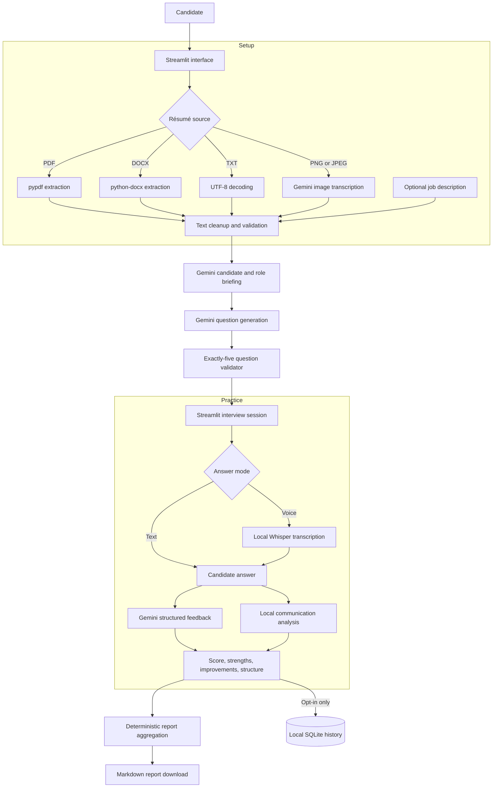
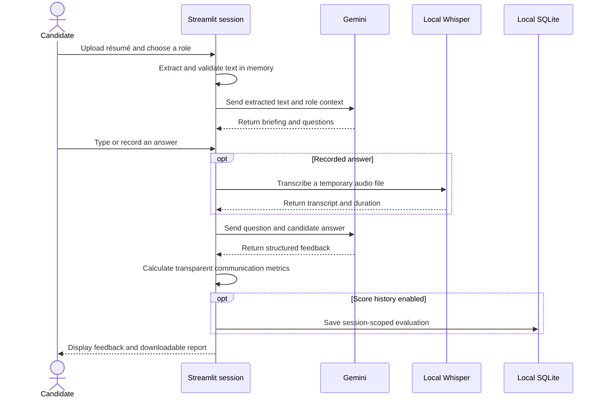

# System architecture

AI Interview Coach combines generative-AI tasks with deterministic Python
analysis. The language model is used where interpretation is useful; parsing,
validation, communication metrics, persistence, and report aggregation remain
explicit application code.

## End-to-end flow

## Component responsibilities

| Component | Responsibility |
| --- | --- |
| `app.py` | Page composition, session state, interview navigation, and user actions |
| `utils/pdf_reader.py` | File limits, format routing, extraction, cleanup, and actionable errors |
| `utils/gemini_client.py` | Credential lookup, Gemini client calls, and backup-model retry |
| `utils/summarizer.py` | Résumé-to-role briefing and job-description comparison prompt |
| `utils/question_generator.py` | Five-question prompt and strict numbered-list parsing |
| `utils/evaluator.py` | Structured answer-feedback prompt and score validation |
| `utils/speech.py` | ffmpeg discovery, temporary audio handling, and local Whisper transcription |
| `utils/communication.py` | Word count, filler-word count, speaking rate, and communication score |
| `utils/report.py` | Session-level score and feedback aggregation |
| `utils/database.py` | Parameterized, session-scoped optional SQLite history |
| `utils/styles.py` | Shared responsive theme, navigation, progress stepper, and accessibility mode |

## Data lifecycle

Uploaded résumés and job descriptions are processed in memory. Recorded audio
is written only to a temporary file for transcription and is removed when the
temporary context closes. Evaluation history is written to SQLite only when the
user enables local score history.

## Trust boundaries

- **Gemini boundary:** résumé/job-description text and typed or transcribed
  answers are sent to the configured Gemini API for generation and evaluation.
- **Local model boundary:** recorded audio is transcribed by Whisper on the
  application host.
- **Persistence boundary:** SQLite persistence is local, optional, and keyed by
  a randomly generated interview-session identifier.
- **Public deployment boundary:** the prototype has no user accounts,
  encrypted personal storage, retention controls, or deletion workflow. It
  should not be treated as a production hiring platform.

## Design decisions

1. **Keep measurable signals deterministic.** Filler words, word counts,
   speaking rate, and report averages can be inspected and tested.
2. **Validate model output before using it.** Question generation must yield
   exactly five questions, and answer feedback must contain a valid 1–10 score.
3. **Make persistence opt-in.** Practice works without writing answer history
   to the database.
4. **Separate modules by responsibility.** AI access, document extraction,
   speech, analysis, persistence, and presentation can evolve independently.
